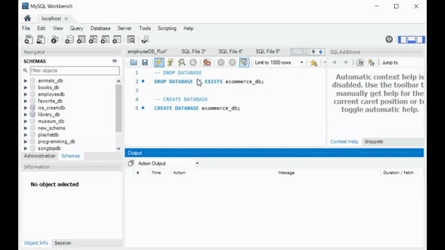
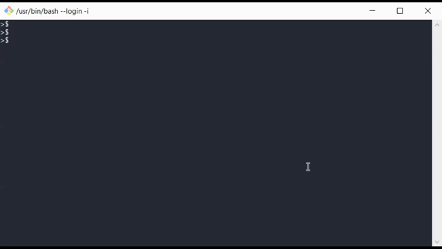
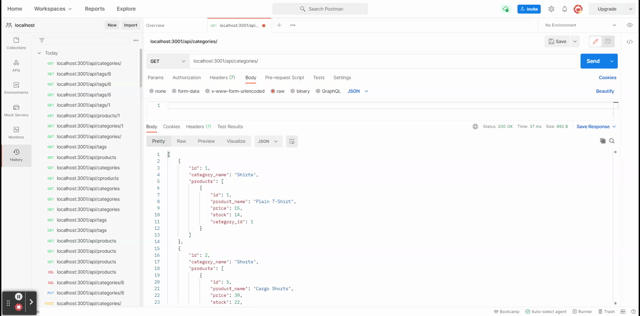

# E-Commerce Back End

This **e-commerce** is to build the back end for an e-commerce site with Express.js API to use Sequelize to interact with a MySQL database based on Object-Relational Mapping (ORM).   
It will not be deployed but provide functionality and all of the acceptance criteria being met. 
This contains the video and add it to the readme of the project. 

## Features

This is a back end for the e-commerce website that use Express.js API

1. add the database name, MySQL username, and MySQL password to an environment variable file
2. `schema.sql` file in the `db` folder to create your database with MySQL shell commands
3. connect to a database using Sequelize
4. enter schema and seed commands
5. create a development database and is seeded with test data : npm run seed
6. run the command to invoke the application : npm start
7. the server is started and the Sequelize models are synced to the MySQL database
8. open API GET routes in Insomnia Core for categories, products, or tags
`product-routes.js`, `tag-routes.js`, and `category-routes.js` 
9. the data for each of these routes is displayed in a formatted JSON
10. test API POST, PUT, and DELETE routes in Insomnia Core
11. able to successfully create, update, and delete data in the database ecommerce_db

## Portfolio

* how to create the schema from the MySQL shell: 

* how to seed the database from the command line: 

* how to start the application’s server: 

* GET routes for all categories, all products, and all tags being tested in Insomnia Core : GET tags,” “GET Categories,” and “GET All Products: 

* GET routes for a single category, a single product, and a single tag being tested in Insomnia Core: “GET tag by id,” “GET Category by ID,” and “GET One Product” 

* POST, PUT, and DELETE routes for categories, products, and tags being tested in Insomnia Core: “DELETE Category by ID,” “CREATE Category,” and “UPDATE Category.”” 

## Links

* [MySQL2](https://www.npmjs.com/package/mysql2) and [Sequelize](https://www.npmjs.com/package/sequelize) packages to connect your Express.js API to a MySQL database 
* [dotenv](https://www.npmjs.com/package/dotenv) package to use environment variables to store sensitive data.
 

 --- 
 © klhi3